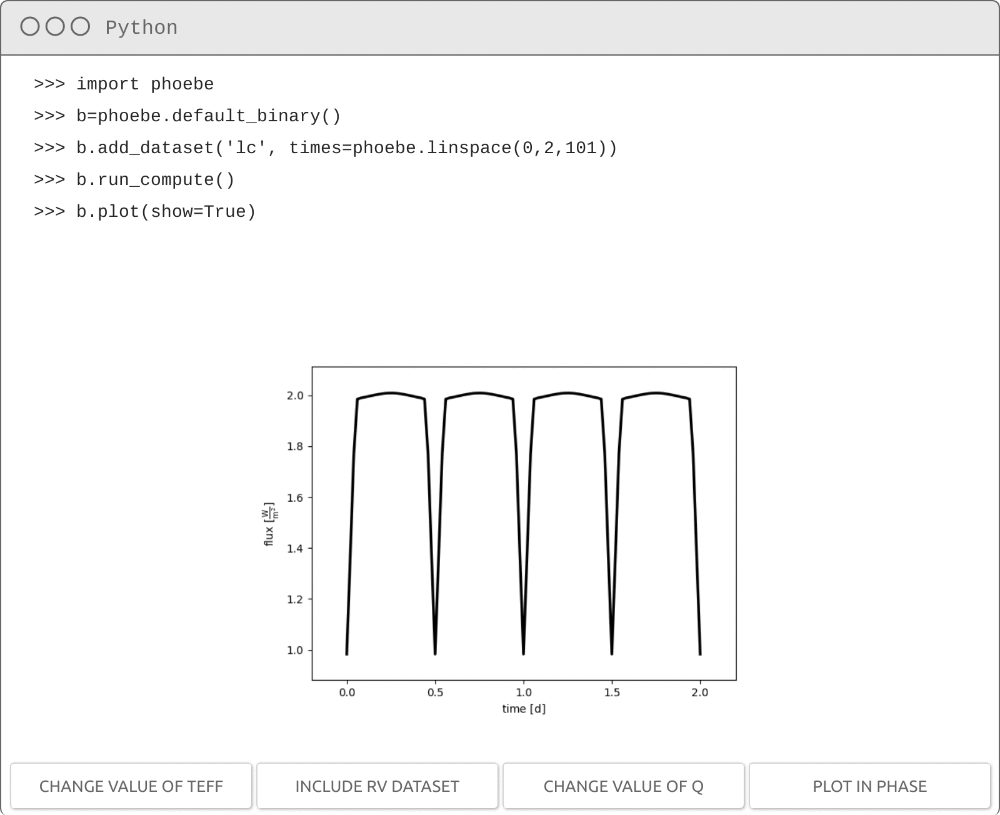

PHOEBE 2.4
------------------------

<pre align="center" style="text-align:center; font-family:monospace; margin: 30px">
  pip install phoebe
</pre>

  
  
  
  
  
 
  
  
  
  
  

  

INTRODUCTION
------------

PHOEBE stands for PHysics Of Eclipsing BinariEs. PHOEBE is pronounced [fee-bee](https://www.merriam-webster.com/dictionary/phoebe?pronunciation&lang=en_us&file=phoebe01.wav).

PHOEBE 2 is a rewrite of the original PHOEBE code. For most up-to-date information please refer to the PHOEBE project webpage: [http://phoebe-project.org](http://phoebe-project.org)

PHOEBE 2.0 is described by the release paper published in the Astrophysical Journal Supplement, [Prša et al. (2016, ApJS 227, 29)](https://ui.adsabs.harvard.edu/#abs/2016ApJS..227...29P).  The addition of support for misaligned stars in version 2.1 is described in [Horvat et al. (2018, ApJS 237, 26)](https://ui.adsabs.harvard.edu/#abs/2018ApJS..237...26H).  Interstellar extinction and support for Python 3 was added in version 2.2 and described in [Jones et al. (2020, ApJS 247, 63)](https://ui.adsabs.harvard.edu/abs/2020ApJS..247...63J).  Inclusion of a general framework for solving the inverse problem as well as support for the [web and desktop clients](http://phoebe-project.org/clients) was introduced in version 2.3 as described in [Conroy et al. (2020, ApJS 250, 34)](https://ui.adsabs.harvard.edu/abs/2020ApJS..250...34C), which also removes support for Python 2.  PHOEBE 2.4 improves on the geometry and ebai estimators, updates gaussian processes to use either scikit-learn or celerite2, and adds support for submitting compute or solver runs on external servers.  These updates and fitting "best practices" will be discussed in Kochoska et al., in prep.

PHOEBE 2 is released under the [GNU General Public License v3](https://www.gnu.org/licenses/gpl-3.0.en.html).

The source code is available for download from the [PHOEBE project homepage](http://phoebe-project.org) and from [github](https://github.com/phoebe-project/phoebe2).

The development of PHOEBE 2 is funded in part by [NSF grant #1517474](https://www.nsf.gov/awardsearch/showAward?AWD_ID=1517474), [NSF grant #1909109](https://www.nsf.gov/awardsearch/showAward?AWD_ID=1909109) and [NASA 17-ADAP17-68](https://ui.adsabs.harvard.edu/abs/2017adap.prop...68P).

DOWNLOAD AND INSTALLATION
-------------------------

The easiest way to download and install PHOEBE 2 is by using pip (make sure you're using the correct command for pip that points to your python3 installation - if in doubt use something like `python3 -m pip install phoebe`):

    pip install phoebe

To install it site-wide, prefix the `pip` command with `sudo` or run it as root.

To download the PHOEBE 2 source code, use git:

    git clone https://github.com/phoebe-project/phoebe2.git

To install PHOEBE 2 from the source locally, go to the `phoebe2/` directory and issue:

    python3 setup.py build
    python3 setup.py install --user

To install PHOEBE 2 from the source site-wide, go to the `phoebe2/` directory and issue:

    python3 setup.py build
    sudo python3 setup.py install

Note that as of the 2.3 release, PHOEBE requires Python 3.6 or later.  For further details on pre-requisites consult the [PHOEBE project webpage](http://phoebe-project.org/install/2.4).

GETTING STARTED
---------------

PHOEBE 2 has a fairly steep learning curve. To start PHOEBE from python, issue:

    python
    >>> import phoebe
    >>>

As of the 2.3 release, PHOEBE also includes a desktop and web client user-interface which is installed independently of the python package here.  See the [phoebe2-ui repository](https://github.com/phoebe-project/phoebe2-ui) and [phoebe-project.org/clients](http://phoebe-project.org/clients) for more details.

To understand how to use PHOEBE, please consult the [tutorials, scripts and manuals](http://phoebe-project.org/docs/2.4/) hosted on the PHOEBE webpage.

CHANGELOG
----------

### 2.4.9 - asynchronous spots bugfix

* fixes bug introduced in 2.4.8 and ensures that temperatures are recomputed for spots when the star is rotating asynchronously.

### 2.4.8 - spots optimization bugfix

* spots no longer force the mesh to be recomputed at each timepoint.
* updates for numpy compatibility and wider test matrix.

### 2.4.7 - line profile bugfix

* fix bug where wavelength arrays that did not include the central wavelength were returning nans for fluxes.

### 2.4.6 - potential to requiv TypeError bugfix

* fix bug where libphoebe was incorrectly raising an error suggesting the potential was out of bounds.

### 2.4.5 - negative mass bugfix

* fix bug where mass could be set to a negative value causing constraints to resolve to nans.

### 2.4.4 - constraint flipping bugfix

* fix bug where flipping Kepler's third law constraint multiple times would fail.
* fix bug when flipping requivsumfrac and requivratio constraints.

### 2.4.3 - use_server with features bugfix

* fix typo that raised error when using use_server with features attached
* added new `addl_slurm_kwargs` parameter to pass any options to slurm scheduler

### 2.4.2 - l3 handling distance in absolute pblum_mode bugfix

* fix conversion between l3 and l3_frac to account for distance when pblum_mode
  is absolute
* fix tagged phoebe version in cached bundles to avoid import warning

### 2.4.1 - solver filtering and plotting bugfix

* fix filtering error when not explicitly passing solver to run_solver
* fix exposing analytic model from lc geometry estimator
* fix phase-sorting when plotting solution from ebai estimator

### 2.4.0 - solver and gaussian process improvements release

* add support for differential evolution optimizer solver
* add support for differential corrections optimizer solver
* optimizers: ability to continue runs from previous solutions (for most optimizers)
* improvements to geometry and ebai estimators to use ligeor as a new built-in dependency
* gaussian processes now use celerite2 or scikit-learn instead of celerite
* emcee sampler: additional plotting styles to check for convergence, checks to ensure starting sample is physical, and added ability to continue a previous run from any arbitrary iteration in a previous run
* new support for running jobs on external servers via crimpl
* clarified distinction between chi2 and mle

### 2.3.63 - constraint feature bugfix

* fix bug where creating a custom constraint for parameters within features was not correctly identifying the constrained parameter and was raising an error when attempting to set the value of the constraining parameter.

### 2.3.62 - attach_job ferr bugfix

* fix bug where error file was not properly loaded when retrieving error from external job

### 2.3.61 - M1 compiler optimization bugfix

* remove compiler optimizations that are not portable to ARM architectures

### 2.3.60 - passband timestamp bugfix

* compare version strings instead of datetime to avoid some systems throwing an error when looking for passband updates.
* see also 2.3.13 release.

### 2.3.59 - extinction constraint bugfix

* fixes extinction constraint when flipping to solve for Av

### 2.3.58 - astropy 5.0 units bugfix

* fixes support for astropy 5.0 changes to unit physical types (see also 2.3.51).
* b.save now requires delayed and failed constraints to run before saving.

### 2.3.57 - remove inadvertent typo while sampling distributions

* introduced in 2.3.55

### 2.3.56 - setup without m2r bugfix

* fixes installation (on some machines) where m2r is not installed

### 2.3.55 - sample_distribution_collection index bugfix

* fixes handling distributions on array parameters within sample_distribution_collection and run_compute(sample_from).

### 2.3.54 - distribution bugfix

* updates `distl` to convert units with recent changes to astropy.  See also the changes in 2.3.51 and 2.3.52.
* fixes median introduced in 2.3.52 to act on distribution object instead of just arrays.

### 2.3.53 - adopt_solution adopt_values bugfix

* adopting a solution with `adopt_values=True` for a sampler solver will now adopt the median from the samples rather than the mean, to be consistent with the central values reported by the distributions themselves.

### 2.3.52 - run_all_constraints support for array parameters bugfix

* fixes new run_all_constraints (new in 2.3.51) method to work on array parameters (compute_times/compute_phases).

### 2.3.51 - units physical type astropy update bugfix

* fixes parsing the physical type of a unit in latest releases of astropy.  Without this fix, some constraints may fail to run.  
* implements a new b.run_all_constraints, which is now automatically called when importing from a file in case any constraints were in the failed state.

### 2.3.50 - contact binary estimators bugfix

* rv_geometry: explicitly look for RVs attached to stars (not envelopes, which raised a lookup error).
* run_checks_solver: run compatibility checks between solver and hierarchies.  Contact binaries are not supported by lc_geometry or ebai, single stars are not supported by lc_geometry, ebai, or rv_geometry.

### 2.3.49 - requivsumfrac flipping bugfix

* fix remaining cases for flipping requivsumfrac constraint (see 2.3.45 bugfix release for the partial fix for some, but not all, cases)
* migrate from Travis CI to GitHub actions for CI testing

### 2.3.48 - mu atm out-of-bounds bugfix

* fixes atmosphere out-of-bounds error caused by mu that should be exactly 0 or 1, but numerically out-of-bounds.

### 2.3.47 - calculate_lnp bugfix

* fixes calculate_lnp to more robustly handle parameter matching for both the constrained and unconstrained case
* fixes default_binary constructor when overriding label of the 'binary' orbit
* fixes typo in ellc backend for the period==1 case

### 2.3.46 - rvperiodogram SB1 bugfix

* fixes handling of SB1s (RVs with a single component) in the rv_periodogram estimator
* adds checks to forbid zeros in dataset sigmas

### 2.3.45 - requivsumfrac constraint flipping bugfix

* fixes bug in flipping requivsumfrac constraint for requivratio when requiv of the secondary star is already constrained

### 2.3.44 - add_component/figure bugfix

* fixes bug in assigning parameter tags when passing function (as kind) to add_component or add_figure.

### 2.3.43 - RV SB1 residuals bugfix

* fixes silently ignoring component (while calculating residuals, chi2, etc) in an RV dataset in which times are provided, but observational RVs are not.
* improves error messages in calculate_residuals when resulting in no or more than one matches.

### 2.3.42 - RV plotting bugfix

* fixes plotting RVs when compute_times is provided instead of times.  Previously would raise an error that the 'rvs' parameter could not be found as it is hidden in the dataset.

### 2.3.41 - estimators missing sigmas bugfix

* fixes handling of default sigmas within LC estimators when no sigmas are provided in the dataset.

### 2.3.40 - custom lnprobability bugfix

* fixes handling of `custom_lnprobability_callable` when passed to `run_solver`.  Previously an error was raised stating it was not a supported keyword argument and was not passed to the script correctly during `export_solver`.

### 2.3.39 - optimizer progressbar and sample_from infinite failed samples bugfix

* fixes bug in increment size in progressbar for optimizers that appears to go past 100% before completion
* when running a forward model sampling from a distribution (or a solution), only allow 10 failed samples per draw before raising an error to prevent getting stuck in an infinite loop if the parameter space is unphysical
* add_compute(overwrite=True) now allows the existing tag to already exist in solutions (in addition to models)

### 2.3.38 - mvgaussian uncertainties bugfix

* updates distl to 0.3.1 which includes a fix to treat mvgaussian uncertainties from percentiles like other distribution types
* forces updating kepler's third law constraint when importing a bundle from before 2.3.25 bugfix

### 2.3.37 - add_distribution allow_multiple_matches bugfix

* fixes bug where tags on distributions were improperly applied when passing `allow_multiple_matches=True`
* disables run_compute progressbar within solvers
* fixes typo in description of progress parameter

### 2.3.36 - MPI passband directory bugfix

* fixes bug where running phoebe for the first time within MPI crashes due to each processor attempting to create the passband directory.

### 2.3.35 - rotstar bugfix

* bugfix in equation for converting rotation period/frequency to potential that affects the shapes of rapidly rotating stars with distortion_method of 'rotstar'.
* single stars: implements the missing constraint for requiv_max for single star systems.

### 2.3.34 - ebai and continue_from bugfix

* ebai: map phases onto -0.5,0.5 interval after computing phase-shift and sending to ebai
* emcee: cast fitted_uniqueids to list when applying wrap indices for continue_from

### 2.3.33 - constrained and multivariate priors bugfix

* fixes handling of multivariate distributions as priors
* run_compute sample_from: use serial mode when sample_num is 1
* run_compute when passing solution instead of sample_from, default to sample_num=1 if adopt_distributions is False
* export_solver: exclude unneeded distributions/solutions from the exported script to optimize filesize
* export_solver: adds (undocumented until 2.4 release) support for autocontinue
* export_compute: do not require explicitly passing compute if only one exists matching the filter
* calculate_lnp: include_constrained now defaults to True

### 2.3.32 - phoebe-server bugfix

* fixes version of flask-socketio dependency to remain compatible with desktop client
* ensures path and query string are cast to string

### 2.3.31 - SB1 with compute_times bugfix

* fixes fitting radial velocities where only one component has observations (SB1 system) and compute_times are provided.
* compute_residuals now returns an empty array when the corresponding times_array is empty, instead of raising an error

### 2.3.30 - ld_coeffs fitting bugfix

* all fitting ld_coeffs.  Each coefficient is referenced by index and can be fit or have distributions attached independently.  See [tutorial](http://phoebe-project.org/docs/latest/tutorials/fitting_ld_coeffs) for more details.
* also fixes support for [custom constraints](http://phoebe-project.org/docs/latest/tutorials/constraints_custom) which can be used to link ld_coeffs between datasets of the same passband, for example.

### 2.3.29 - adopt_solution bugfix

* do not require passing solution to adopt_solution (when adopting distributions) if only one solution exists
* fix distribution_overwrite_all not defined error

### 2.3.28 - solver checks bugfix

* excludes datasets not supported in fitting (mesh, orb, lp, etc) from forward-model within inverse solvers.
* run_checks_solver now checks for nans in dataset arrays.

### 2.3.27 - add_compute/solver overwrite bugfix

* fixes bug where passing overwrite to add_compute or add_solver raised an error if run_compute/run_solver already created a model/solution tagged with that same label.

### 2.3.26 - multiprocessing bugfix

* allows disabling multiprocessing (or lowering the number of available processors).  Multiprocessing is used by default when not within MPI and when calling `run_compute` with `sample_from` or `run_solver` with solvers that support parallelization.  Some installations of multiprocessing on Mac may cause issues, in which case you can now for PHOEBE to run in serial mode.
* this introduces new `phoebe.multiprocessing_off()`, `phoebe.multiprocessing_on()`, `phoebe.multiprocessing_get_nprocs()`, and `phoebe.multiprocessing_set_nprocs(n)` functions, but the default behavior remains unchanged.

### 2.3.25 - distribution propagation bugfix

* updates distl to 0.2.0 release which includes support for retaining simultaneous sampling between copies of the same underyling distribution, increased precision on latex formatting of uncertainties, and maintaining labels during unit conversion.
* fix propagating distl distribution objects through constraints to arbitrary depth.
* update Kepler's third law constraint to be distl-friendly (1+q becomes q+1).
* parameter.get_distribution: new argument `delta_if_none` to allow returning a delta function.  This is now the default behavior from within b.get/plot_distribution_collection
* b.sample_distribution_collection: rename `N` argument to `sample_size` (but with backwards compatibility support for `N`).
* run_checks_solver now includes a warning if priors contain "around" distributions.

### 2.3.24 - emcee continue_from bugfix

* skip nwalkers vs number of parameters check when continue_from is set
* fallback on twigs when original uniqueids not available (when attempting to continue from a solution loaded into a new bundle, for example)
* wrapping rules for angle parameters fallback on median of last iteration in the available chain when uniqueids do not match as the initializing distribution likely does not exist anymore

### 2.3.23 - ellc flux-weighted RV vsini bugfix

* compute vsini from syncpar and pass to RV to enable Rossiter-McLaughlin effect when rv_method='flux-weighted'.

### 2.3.22 - trace plotting nanslice bugfix

* fix bug in plotting MCMC trace plots when any given chain is all nans.

### 2.3.21 - estimators phase-bin bugfix

* fix bug resulting in a nanslice error when phase_bin is enabled within estimators resulting in a single entry in any given bin.  Now, sigmas will be ignored within the estimator in these cases with a warning in the logger.

### 2.3.20 - legacy passband bugfix

* now correctly maps passbands when using the legacy backend (only affects TESS and Tycho)
* falls back on PHOEBE atmospheres when needing to compute pblums internally for flux scaling prior to calling legacy backend
* from_legacy bugfix in parsing linear limb-darkening coefficients
* export_compute/export_solver: add commment warning against manually editing script
* fixes typo which raised error when rescaling passband-dependent mesh columns

### 2.3.19 - passbands update available datetime string parsing bugfix

* some systems fail to parse common datetime strings, resulting in inability to import phoebe when checking for available passband updates.  This now prints and logs an error message, but does not prevent import.
* checking for available passband updates on import now correctly respects the PHOEBE_ENABLE_ONLINE_PASSBANDS environment variable.
* failed online passbands connection error messages are now only included in the log once (per processor) to avoid spamming the log (but are shown by default when manually calling phoebe.list_online_passbands).

### 2.3.18 - estimator.ebai with wide eclipse bugfix (attempt 2)

* actually fixes bug (see 2.3.13) that raised internal error when running ebai on an eclipse with width larger than 0.25 in phase.  Note that these systems will still return nans as ebai is not well-suited to these systems, but the internal error will no longer occur.

### 2.3.17 - optimizer MPI bugfix

* enables parallelization (per-time or per-dataset) for optimizers.

### 2.3.16 - rv_geometry with different lengths bugfix

* fixes estimator.rv_geometry when primary and secondary component have different times.

### 2.3.15 - alternate backends with l3_frac and dataset-scaled bugfix

* fix bug in applying l3_frac within dataset scaling (pblum_mode='dataset-scaled') when using alternate backends.

### 2.3.14 - import_solution with uniqueid mismatch bugfix

* fix bug where falling back on twigs when importing a solution on a different bundle failed.  It is still suggested to save the bundle and import solutions on the bundle used when calling export_solver.

### 2.3.13 - estimator.ebai with wide eclipse bugfix

* fix bug (but not really - see 2.3.18) that raised internal error when running ebai on an eclipse with width larger than 0.25 in phase.  Note that these systems will still return nans as ebai is not well-suited to these systems, but the internal error will no longer occur.  

### 2.3.12 - plot univariate distributions latex label bugfix

* fix bug in the latex labels on plots when converting from multivariate to univariate distributions.

### 2.3.11 - continue_from run_checks bugfix

* fix bug where run_checks raised an error for an empty init_from if continue_from was set.

### 2.3.10 - alternate backend atm bugfix

* fix bug where atm parameter was ignored during passband luminosity scaling while using an alternate backend, resulting in an atmosphere out-of-bounds error in some situations.

### 2.3.9 - online passbands bugfix

* stop attempting to query online passbands after three failed attempts to avoid significant time cost otherwise.

### 2.3.8 - plotting exclusion bugfix

* fix bug where datasets were excluded from plotting if not in any models
* fix syntax error in run_checks

### 2.3.7 - kwargs errors bugfix

* fix small bugs that could raise errors when passing some filter kwargs to `run_solver` or `sample_distribution_collection`

### 2.3.6 - GP run_checks bugfix

* fix check for presence of observational data during run_checks to only consider datasets with attached gaussian processes (GPs)

### 2.3.5 - lp run_checks bugfix

* fix length comparison of flux_densities and wavelengths during run_checks

### 2.3.4 - passband/extinction bugfix

* fixed Gordon extinction coefficient calculation in line with erratum http://dx.doi.org/10.1088/0004-637X/705/2/1320.
* added check to require updating affected-passbands (versions at tables.phoebe-project.org have been updated)
* removed duplicate Passband methods causing ld/ldint passband computations to fail

### 2.3.3 - latex representation bugfix

* fix the latex representation string for `fillout_factor`, `pot`, `pot_min`,
  and `pot_max` parameters in a contact binary.

### 2.3.2 - manifest to include readme bugfix

* manually include README.md in MANIFEST.in to avoid build errors from pip

### 2.3.1 - pip install bugfix

* removes m2r as an (unlisted) build-dependency.  m2r is only required to build the submission to submit to pypi, but is not required to install or run phoebe locally.

### 2.3.0 - inverse problem feature release

* Add support for inverse problem solvers, including "estimators", "optimizers", and "samplers"
* Add support for attaching distributions (as [distl](https://github.com/kecnry/distl) objects) to parameters, including priors and posteriors.
* Add support for [web and desktop clients](http://phoebe-project.org/clients) via a light-weight built in `phoebe-server`.
* Removed support for Python 2 (now requires Python 3.6+)
* Implement optional gaussian processes for light curves
* Implement phase-masking
* Added official support for [ellc](https://github.com/pmaxted/ellc) and [jktebop](https://www.astro.keele.ac.uk/jkt/codes/jktebop.html) alternate backends
* Per-component and per-dataset RV offsets
* Fixed phasing in time-dependent systems
* Distinction between anomalous and sidereal period in apsidal motion cases
* Extinction parameters moved from per-dataset to the system-level
* Added several new optional constraints
* Overhaul of the run_checks framework
* Updated scipy dependency to 1.7+
* Numerous small bugfixes and enhancements

### 2.2.2 - kwargs bugfix

* fix overriding mesh_init_phi as kwarg to run_compute
* fix pblum computation to not require irrad_method kwarg
* fix bundle representation to exclude hidden parameters

### 2.2.1 - g++/gcc version check bugfix

* Improves the detection of g++/gcc version to compare against requirements during setup.

### 2.2.0 - extinction feature release

* Add support for interstellar extinction/reddening.
* Support for Python 3.6+ in addition to Python 2.7+.
* Overhaul of limb-darkening with new ld_mode and ld_coeffs_source parameters.
* Overhaul of passband luminosity and flux scaling with new pblum_mode parameter, including support for maintaining color relations between multiple passbands.
* Ability to provide third light in either flux or percentage units, via the new l3_mode and l3_frac parameters.
* Support for computing a model at different times than the observations, via the new compute_times or computes_phases parameter.
* Transition from pickled to FITS passband files, with automatic detection for available updates.  The tables can now also be accessed via tables.phoebe-project.org.
* DISABLED support for beaming/boosting.
* Allow flipping Kepler's thrid law constraint to solve for q.
* Require overwrite=True during add_* or run_* methods that would result in overwriting an existing label.
* Constraint for logg.
* Account for time-dependence (dpdt/dperdt) in t0 constraints.

### 2.1.17 - ignore fits passbands bugfix

* Future-proof to ignore for passband files with extensions other than ".pb"
  which may be introduced in future versions of PHOEBE.

### 2.1.16 - eccentric/misaligned irradiation bugfix

* Fixes bug where irradiation was over-optimized and not recomputed as needed for
  eccentric or misaligned orbits.  Introduced in the optimizations in 2.1.6.

### 2.1.15 - spots bugfix

* Fixes 'long' location of spots on single stars.
* Fixes treatment of spots on secondary 'half' of contact systems.
* Fixes loading legacy files with a spot that has source of 0 due to a bug in legacy.
* Fixes overriding 'ntriangles' by passing keyword argument to run_compute.

### 2.1.14 - contacts inclination RVs bugfix

* Fixes the polar rotation axis for RVs in contact systems with non-90 inclinations
  by re-enabling the alignment (pitch, yaw) constraints and enforcing them to be 0.

### 2.1.13 - constraint flip loop bugfix

* Fixes infinite loop when trying to flip esinw AND ecosw
* Adds ability to flip mass (Kepler's third law) to solve for q
* Fixes bug introduced in 2.1.9 in which out-of-limits constrained parameters in
an envelope were being raised before all constraints could resolve successfully.

### 2.1.12 - legacy ephemeris and kwargs checks bugfix

* Fixes applying t0 when importing legacy dataset which use phase.
* Fixes ignoring other compute options when running checks on kwargs during run_compute.

### 2.1.11 - legacy dataset import bugfix

* Fixes loading legacy datasets which use phase (by translating to time with the current ephemeris).
* Fixes loading legacy datasets with errors in magnitudes (by converting to errors in flux units).
* Fixes plotting RV datasets in which only one component has times (which is often the case when importing from a legacy file).

### 2.1.10 - ldint bugfix

* Removes ldint from the weights in the computations of RVs and LPs.

### 2.1.9 - limits bugfix

* Fixes a bug where parameter limits were not being checked and out-of-limits errors not raised correctly.

### 2.1.8 - mesh convergence bugfix

* Fixes a bug where certain parameters would cause the meshing algorithm to fail to converge.  With this fix, up to 4 additional attempts will be made with random initial starting locations which should converge for most cases.

### 2.1.7 - comparison operators bugfix

* Fixes a bug where comparisons between Parameters/ParameterSets and values were returning nonsensical values.
* Comparing ParameterSets with any object will now return a NotImplementedError
* Comparing Parameters will compare against the value or quantity, with default units when applicable.
* Comparing equivalence between two Parameter objects will compare the uniqueids of the Parameters, NOT the values.

### 2.1.6 - optimization bugfix

* Fixes a bug where automatic detection of eclipses was failing to properly fallback on only detecting the horizon.
* Introduces several other significant optimizations, particularly in run_compute.

### 2.1.5 - single star get_orbits and line-profile bugfix

* Fixes a bug in hierarchy.get_orbits() for a single star hierarchy which resulted in an error being raised while computing line-profiles.

### 2.1.4 - freq constraint bugfix

* This fixes the inversion of the frequency constraint when flipping to solve for period.

### 2.1.3 - overflow error for semidetached systems bugfix

* Semi-detached systems could raise an error in the backend caused by the volume being slightly over the critical value when translating between requiv in solar units to volume in unitless/roche units.  When this numerical discrepancy is detected, the critical value is now adopted and a warning is sent via the logger.

### 2.1.2 - constraints in solar units bugfix

* All constraints are now executed (by default) in solar units instead of SI.  The Kepler's third law constraint (constraining mass by default) failed to have sufficient precision in SI, resulting in inaccurate masses.  Furthermore, if the constraint was flipped, inaccurate values of sma could be passed to the backend, resulting in overflow in the semi-detached case.
* Bundles created before 2.1.2 and imported into 2.1.2+ will continue to use SI units for constraints and should function fine, but will not benefit from this update and will be incapable of changing the system hierarchy.

### 2.1.1 - MPI detection bugfix

* PHOEBE now detects if its within MPI on various different MPI installations (previously only worked for openmpi).

### 2.1.0 - misalignment feature release

* Add support for spin-orbit misalignment
* Add support for line profile (LP) datasets
* Switch parameterization from rpole/pot to requiv (including new semi-detached and contact constraints)
* Significant rewrite to plotting infrastructure to use [autofig](http://github.com/kecnry/autofig)
* Introduction of [nparray](http://github.com/kecnry/nparray) support within parameters
* Significant rewrite to mesh dataset infrastructure to allow choosing which columns are exposed
* Distinguish Roche (xyz) from Plane-of-Sky (uvw) coordinates
* Ability to toggle interactive constraints and interactive system checks independently
* Implementation of ParameterSet.tags and Parameter.tags
* General support for renaming tags/labels
* Expose pblum for contacts
* Expose per-component r and rprojs for contacts (used to be based on primary frame of reference only)
* Fix definition of vgamma (see note in 2.0.4 release below)
* Remove phshift parameter (see note in 2.0.3 release below)
* Permanently rename 'long' parameter for spots (see note in 2.0.2 release below)
* Numerous other minor bug fixes and improvements

### 2.0.11 - astropy version dependency bugfix

* Set astropy dependency to be >=1.0 and < 3.0 (as astropy 3.0 requires python 3)

### 2.0.10 - legacy import extraneous spaces bugfix

* Handle ignoring extraneous spaces when importing a PHOEBE legacy file.

### 2.0.9 - \_default Parameters bugfix

* Previously, after loading from a JSON file, new datasets were ignored by run_compute because the \_default Parameters (such as 'enabled') were not stored and loaded correctly.  This has now been fixed.
* PS.datasets/components now hides the (somewhat confusing) \_default entries.
* unicode handling in filtering is improved to make sure the copying rules from JSON are followed correctly when loaded as unicodes instead of strings.

### 2.0.8 - contacts bugfix

* Remove unused Parameters from the Bundle
* Improvement in finding the boundary between the two components of a contact system

### 2.0.7 - legacy import/export bugfix

* Handle missing parameters when importing/exporting so that a Bundle exported to a PHOEBE legacy file can successfully be reimported
* Handle importing standard weight from datasets and converting to sigma

### 2.0.6 - unit conversion bugfix

* When requesting unit conversion from the frontend, astropy will now raise an error if the units are not compatible.

### 2.0.5 - semi-detached bugfix

* Fixed bug in which importing a PHOEBE legacy file of a semi-detached system failed to set the correct potential for the star filling its roche lobe.  This only affects the importer itself.
* Implemented 'critical_rpole' and 'critical_potential' constraints.

### 2.0.4 - vgamma temporary bugfix

* The definition of vgamma in 2.0.* is in the direction of positive z rather than positive RV.  For the sake of maintaining backwards-compatibility, this will remain unchanged for 2.0.* releases but will be fixed in the 2.1 release to be in the direction of positive RV.  Until then, this bugfix handles converting to and from PHOEBE legacy correctly so that running the PHOEBE 2 and legacy backends gives consistent results.

### 2.0.3 - t0_supconj/t0_perpass bugfix

* Fixed constraint that defines the relation between t0_perpass and t0_supconj.
* Implement new 't0_ref' parameter which corresponds to legacy's 'HJD0'.
* Phasing now accepts t0='t0_supconj', 't0_perpass', 't0_ref', or a float representing the zero-point.  The 'phshift' parameter will still be supported until 2.1, at which point it will be removed.
* Inclination parameter ('incl') is now limited to the [0-180] range to maintain conventions on superior conjunction and ascending/descending nodes.
* Fixed error message in ldint.
* Fixed the ability for multiple spots to be attached to the same component.
* Raise an error if attempting to attach spots to an unsupported component.  Note: spots are currently not supported for contact systems.

### 2.0.2 - spots bugfix

* If using spots, it is important that you use 2.0.2 or later as there were several important bug fixes in this release.
* 'colon' parameter for spots has been renamed to 'long' (as its not actually colongitude).  For 2.0.X releases, the 'colon' parameter will remain as a constrained parameter to avoid breaking any existing scripts, but will be removed with the 2.1.0 release.
* Features (including spots) have been fixed to correctly save and load to file.
* Corotation of spots is now enabled: if the 'syncpar' parameter is not unity, the spots will correctly corotate with the star.  The location of the spot (defined by 'colat' and 'long' parameters) is defined such that the long=0 points to the companion star at t0.  That coordinate system then rotates with the star according to 'syncpar'.

### 2.0.1 - ptfarea/pbspan bugfix

* Definition of flux and luminosity now use ptfarea instead of pbspan.  In the bolometric case, these give the same quantity. This discrepancy was absorbed entirely by pblum scaling, so relative fluxes should not be affected, but the underlying absolute luminosities were incorrect for passbands (non-bolometric).  In addition to under-the-hood changes, the exposed mesh column for 'pbspan' is now removed and replaced with 'ptfarea', but as this is not yet a documented column, should not cause backwards-compatibility issues.  

### 2.0.0 - official release of PHOEBE 2.0

* PHOEBE 2.0 is not backwards compatible with PHOEBE 2.0-beta (although the interface has not changed appreciably) or with PHOEBE 2.0-alpha (substantial rewrite). Going forward with incremental releases, every effort will be put into backwards compatibility. The changes and important considerations of the new version will be detailed in the ChangeLog.

* If upgrading from PHOEBE 2.0-beta or PHOEBE 2.0-alpha, it is necessary to do a clean re-install (clear your build and installation directories), as the passband file format has changed and will not automatically reset unless these directories are manually cleared.  Contact us with any problems.

QUESTIONS? SUGGESTIONS? CONCERNS?
---------------------------------

Contact us! Issues and feature requests should be submitted directly through GitHub's [issue tracker](https://github.com/phoebe-project/phoebe2/issues).  Additional questions or feature requests should be submitted via [GitHub PHOEBE2 discussions](https://github.com/phoebe-project/phoebe2/discussions) or [GitHub PHOEBE2-UI discussions](https://github.com/phoebe-project/phoebe2-ui/discussions). We are eager to hear from you, so do not hesitate to [contact us](http://phoebe-project.org/help/contact)!
