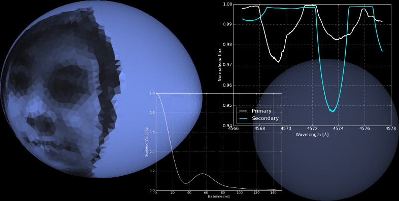

.. pyphoebe documentation master file, created by
   sphinx-quickstart on Fri Apr 27 10:45:43 2012.
   You can adapt this file completely to your liking, but it should at least
   contain the root `toctree` directive.

.. contents:: Table of contents
   :depth: 2

###################################
Easy Start
###################################

1. The :ref:`Easy start <label-easystart>` gives you the shortest route to a working installation.
2. The :ref:`Backend tutorials <label-backend-tutorials>` give you a set of example scripts for you to start from.

   
   Spectrum and visibility of a binary system with an awkward effective temperature pattern.
   The colors in the image represent the black body color of the local effective
   temperature and darkened according to the local limb-darkened intensity.

###################################
Introduction
###################################

Phoebe 2.0 is a rewrite of the famous Wilson-Devinney
code to model (eclipsing) binaries. Currently, the new implementation shares
no code with the original model, but draws heavily from its experience. A lot
of care has been taken to make the code accurate and extendable. Here is a
list of features already included in the code (to some extent at least):

* generic surface triangulation (i.e. any shape)
* roche deformed single, binary and multiple stars
* misaligned binaries
* accretion disks
* computation of absolute fluxes (i.e. in real units)
* Multicolour photometry (e.g. for SED fitting)
* generic eclipse detection (i.e. any shape)
* parametrized limb darkening
* model atmosphere interpolation and black body atmospheres
* interstellar reddening
* heating and scattering (reflection effect)
* heat redistribution processes (local, global and directional)
* differentially rotating single stars
* circular spots
* spherical pulsations (nonrotating, coriolis force and traditional approximation)
* spherical pulsations on top of Roche deformed stars
* doppler beaming and boosting and gravitational redshifts
* Roemer delay and light time travel effects
* Macroturbulence
* dipolar magnetic fields
* 3D-orbits
* computation of light curves, radial velocity curves, spectra, spectopolarimetry, interferometry and images
* connection to spectral synthesis grids
* hierarchical systems and n-body simulations
* inclusion of single star approximations in binary orbits
* analytical approximation of specific cases (Mandel and Agol...)
* Native Python interface to the Wilson-Devinney code and comparison with Phoebe
* nonlinear fitting methods, with parameter bounds and constraints
* MCMC sampling methods, with general prior definition, parameter bounds and constraints
* MINUIT fitting interface
* unit conversion and physical constants

These web pages contain examples of how to use Phoebe, from simple examples,
sometimes reproducing peer-reviewed scientific results, to advanced examples that extend the
base code. The :ref:`label-backend-tutorials` are meant as:

* examples for people new to the code
* scripts to start from when running simulations
* an extensive set of cases for evaluating and testing the code

Some bugs certainly remain. If you find errors,
please feel free to contact the developer or improve upon them!

Perhaps you prefer to read these pages as a :download:`PDF book <_build/latex/phoebe.pdf>`.

###################################
Getting started
###################################

These pages contain information on how to download an install Phoebe 2.0. It
lists the required and recommended 3rd party dependencies, defines the
coding style and explains how to profile the code to establish the speed
bottle-necks.

.. toctree::
   :maxdepth: 2
   
   how_to_setup

Once Phoebe 2.0 is installed, these sections go into detail explaining a
minimal example, so that noobs get a bit more familiar with the code. If you
are in a hurry you can download

- the introductory example as a fully commented :download:`Python script <minimal_example.py>`
- the :download:`Python script<minimal_example_bare.py>`  without comments.

But if you prefer a guided tour, read the following pages:
   
.. toctree::
   :maxdepth: 2

   minimal_example

Let's extend that minimal example a little bit more:

.. toctree::
   :maxdepth: 2
    
   how_to_binary
   how_to_bundle
   
And perhaps a special section on saving and loading files in all kinds of formats?
    

###################################
Quick reference
###################################

+------------------------------------------------------------------------------------------------------------------------------------------------+---------------------------------------------------------+
| **Parameters & Data**                                                                                                                          |                                                         |
+------------------------------------------------------------------------------------------------------------------------------------------------+---------------------------------------------------------+
| :py:class:`ParameterSet <phoebe.parameters.parameters.ParameterSet>` ([context])                                                               | ParameterSet                                            |
+------------------------------------------------------------------------------------------------------------------------------------------------+---------------------------------------------------------+
| :py:class:`LCDataSet <phoebe.parameters.datasets.LCDataSet>` ([context])                                                                       | Light curve                                             |
+------------------------------------------------------------------------------------------------------------------------------------------------+---------------------------------------------------------+
| :py:class:`RVDataSet <phoebe.parameters.datasets.RVDataSet>` ([context])                                                                       | Radial velocities                                       |
+------------------------------------------------------------------------------------------------------------------------------------------------+---------------------------------------------------------+
| :py:class:`SPDataSet <phoebe.parameters.datasets.SPDataSet>` ([context])                                                                       | Spectra                                                 |
+------------------------------------------------------------------------------------------------------------------------------------------------+---------------------------------------------------------+
| :py:class:`IFDataSet <phoebe.parameters.datasets.IFDataSet>` ([context])                                                                       | Interferometry                                          |
+------------------------------------------------------------------------------------------------------------------------------------------------+---------------------------------------------------------+
| **Bodies**                                                                                                                                     |                                                         |
+------------------------------------------------------------------------------------------------------------------------------------------------+---------------------------------------------------------+
| :py:class:`Star <phoebe.backend.universe.Star>` (star, mesh, [pbdep, obs, puls, circ_spot])                                                    | Star                                                    |
+------------------------------------------------------------------------------------------------------------------------------------------------+---------------------------------------------------------+
| :py:class:`BinaryRocheStar <phoebe.backend.universe.BinaryRocheStar>` (component, [mesh, orbit, pbdep, obs])                                   | BinaryRocheStar                                         |
+------------------------------------------------------------------------------------------------------------------------------------------------+---------------------------------------------------------+
| :py:class:`BinaryRocheStar <phoebe.backend.universe.BinaryStar>` (star, mesh, [orbit, pbdep, obs, puls, circ_spot])                            | BinaryStar                                              |
+------------------------------------------------------------------------------------------------------------------------------------------------+---------------------------------------------------------+
| :py:class:`BodyBag <phoebe.backend.universe.BodyBag>` (list_of_bodies, [orbit, obs])                                                           | BodyBag                                                 |
+------------------------------------------------------------------------------------------------------------------------------------------------+---------------------------------------------------------+
| :py:class:`BinaryBag <phoebe.backend.universe.BinaryBag>` ((primary, secondary), orbit)                                                        | BinaryBag                                               |
+------------------------------------------------------------------------------------------------------------------------------------------------+---------------------------------------------------------+
| **Input & output**                                                                                                                             |                                                         |
+------------------------------------------------------------------------------------------------------------------------------------------------+---------------------------------------------------------+
| :py:func:`get_basic_logger <phoebe.utils.utils.get_basic_logger>` ([style, clevel, flevel, filename, filemode])                                | Display log message to the screen                       |
+------------------------------------------------------------------------------------------------------------------------------------------------+---------------------------------------------------------+
| :py:func:`load_ps <phoebe.parameters.parameters.load>` (filename)                                                                              | Load ParameterSets                                      |
+------------------------------------------------------------------------------------------------------------------------------------------------+---------------------------------------------------------+
| :py:func:`load_body <phoebe.backend.universe.load>` (filename)                                                                                 | Load Bodies                                             |
+------------------------------------------------------------------------------------------------------------------------------------------------+---------------------------------------------------------+
| **Computations**                                                                                                                               |                                                         |
+------------------------------------------------------------------------------------------------------------------------------------------------+---------------------------------------------------------+
| :py:func:`compute <phoebe.backend.observatory.compute>` (system, [params, mpi, extra_func, extra_func_kwargs])                                 | Automatically compute synthetics                        |
+------------------------------------------------------------------------------------------------------------------------------------------------+---------------------------------------------------------+
| :py:func:`observe <phoebe.backend.observatory.observe>` (system, times, [lc, rv, sp, pl, im, mpi, extra_func, extra_func_kwargs, \*\*params])  | Compute synthetics on given time array                  |
+------------------------------------------------------------------------------------------------------------------------------------------------+---------------------------------------------------------+
| :py:func:`image <phoebe.backend.observatory.image>` (system, [ref, select])                                                                    | Generate an image of a Body                             |
+------------------------------------------------------------------------------------------------------------------------------------------------+---------------------------------------------------------+
| :py:func:`make_spectrum <phoebe.backend.observatory.make_spectrum>` (system, [...])                                                            | Generate a spectrum of a Body                           |
+------------------------------------------------------------------------------------------------------------------------------------------------+---------------------------------------------------------+
| **Fitting**                                                                                                                                    |                                                         |
+------------------------------------------------------------------------------------------------------------------------------------------------+---------------------------------------------------------+
| :py:func:`run <phoebe.backend.fitting.run>` (system, [comp_pars, fit_pars, mpi, accept])                                                       | Fit the parameters of a system                          |
+------------------------------------------------------------------------------------------------------------------------------------------------+---------------------------------------------------------+
| :py:func:`ParameterSet.set_adjust <phoebe.parameters.parameters.ParameterSet.set_adjust>` (bool, qualifier_1, [qualifier_2, ..., qualifier_n]) | Specify which parameters to fit                         |
+------------------------------------------------------------------------------------------------------------------------------------------------+---------------------------------------------------------+
| :py:func:`ParameterSet.get_parameter <phoebe.parameters.parameters.ParameterSet.get_parameter>` (qualifier)                                    | Retrieve a Parameter instance from a ParameterSet       |
+------------------------------------------------------------------------------------------------------------------------------------------------+---------------------------------------------------------+
| :py:func:`Parameter.set_adjust <phoebe.parameters.parameters.Parameter.set_adjust>` (bool)                                                     | Set a parameter to be fitted or not                     |
+------------------------------------------------------------------------------------------------------------------------------------------------+---------------------------------------------------------+
| :py:func:`Parameter.set_prior <phoebe.parameters.parameters.Parameter.set_prior>` (\*\*prior_information)                                      | Set the prior distribution of a parameter               |
+------------------------------------------------------------------------------------------------------------------------------------------------+---------------------------------------------------------+

.. _label-backend-tutorials:

###################################
Backend Tutorials
###################################

Most of the examples are structured in the following way:

1. First, all the necessary *modules* are loaded and a logger is created to display
   messages and information
2. Then, all the *parameters* involved in the examples are created and set
3. Once the parameters are known, the *objects* can be created
4. Next, the *observables* are calculated
5. Finally, the *results* are analysed in the form of plots and images.

***************
Building Models
***************

Single Stars
============

.. toctree::
   :maxdepth: 1
    
   testsuite.solar_calibration
   testsuite.fast_rotator
   testsuite.critical_rotator
   testsuite.differential_rotation
   testsuite.spotted_star
   testsuite.pulsating_star
   testsuite.pulsating_rotating
   testsuite.traditional_approximation
   testsuite.sirius
   testsuite.vega
   testsuite.vega_sed
   testsuite.KOI126
   testsuite.dipolar_field
   testsuite.oblique

Binary Stars
=============

.. toctree::
   :maxdepth: 1
    
   testsuite.simple_binary01
   testsuite.occulting_dark_sphere
   testsuite.transit_colors
   testsuite.binary_spheres
   testsuite.pulsating_binary
   testsuite.pulsating_binary2
   testsuite.venus
   testsuite.wd_vs_phoebe
   testsuite.eccentric_orbit
   testsuite.reflection_effect
   testsuite.KPD1946+4340
   testsuite.hv2241
   testsuite.muCas
   testsuite.example_systems
   testsuite.contact_binary
   testsuite.misaligned_binary

Accretion Disks
==================

.. toctree::
   :maxdepth: 1
   
   testsuite.accretion_disk
   testsuite.T_CrB

*********
Fitting
*********

.. toctree::
   :maxdepth: 1
    
   testsuite.body_emul

###################################
GUI Tutorials
###################################

###################
Development notes
###################

***********
Milestones
***********

.. toctree::
   :maxdepth: 1
   
   milestones
   profiling/profile_stats
   verification/compare_atm_int

***********
API docs
***********

.. toctree::
   :maxdepth: 4
   
   phoebe
    

***********************
Developer tutorials
***********************

Extending the base code
=======================

.. toctree::
   :maxdepth: 2
   
   how_to_body
   
Algorithms
===============

Technical stuff
================

.. toctree::
   :maxdepth: 1
    
   meshing_solar
   meshing_rochelobefilling_binary
   surface_element_distribution_rochelobefilling_binary

############################    
Frequently Asked Questions
############################

*Q: When computing a model for a spotted star, consecutive calls to* ``set_time``
*mess up the orientation of the model.*

A: Spots are computed via subdividing surface elements at the spot area. In
order to compute the location for the next spot, you need to restore those
subdivided elements to their original values, via ``system.unsubdivide()``
    
*Q: The radial velocity computations seem to be off by a factor of 8. What's
the deal with that?*

A: The default units in the Universe are solar radii for distance and days for
time. This means that the radial velocities are computed in units of solar radii
per day. You need to multiply them by 8.05 to have them in km/s.
    
*Q: Accessing the mesh of a BodyBag results in a segmentation fault. What's the problem?*

A: You probably attempted to make a BodyBag of a heterogeneous system (i.e.
with different mesh columns). Upon initialization of the BodyBag, set the
keyword ``solve_problems=True``. And your problems should be... well.. solved.
This keyword forces the BodyBag to check for missing fields, and adds them if
required.

*Q: Although set some parameters to be adjustable, none of the parameters are fitted. What's up with that?*

A: You need to set priors to all parameters, regardless of which algorithm you are
using.

*Q: If I switch on reflection, I see no difference in my light curve. In fact, careful inspection of the mesh shows me that there is no refleced light.*

A: Be sure to also set the ``irradiator`` property for the Bodies you wish to "shine".

*Q: I did whatever you said in the previous question, but I still have no reflected light! Liar!*

A: Check the value for the albedo. If you set it equal to unity, all the incoming
radiation will be used to locally heat up the component, instead of reflecting light. Set it to zero (for the irradiated body) to have no heating, but only reflection. Be sure to set the albedo in the passband dependent parameter set too!

*Q: Can I speed up plotting in any way?*

A: You could try changing your backend, e.g via ``matplotlib.rcParams['backend'] = 'Agg'``
but do this before importing Phoebe.

*Q: Is Phoebe 2.x Python 3.x ready?*

A: Some effort has been done to make Phoebe 2.x Python 3.x compliant. In fact,
Phoebe should load when imported in Python 3.x. The essential dependencies
(i.e. numpy, scipy, matplotlib, pyfits...) are Python 3.x ready, as are most of
the nonessential dependencies. Syntactically, Phoebe is Python 3.x compatible,
but most likely the code will fail on a list/iterator ambiguity. Also the
C extensions are not Python 3.x compatible as of yet. 

*Q: Is it safe to use Phoebe?*

A: Actually, it's not. Malicious figures can take advantage of your misplaced
trust when you open parameterSets of untrusted sources. A constraint evaluates
an expression inside the ``parameters`` module. A constraint has thus access
to all modules inside that module, and can use them for dark practices, e.g.
use the ``os`` library to delete files.

    
#################    
Appendices
#################

.. toctree::
   :maxdepth: 1
    
   parlist
   bibliography

* :ref:`genindex`
* :ref:`modindex`
* :ref:`search`

