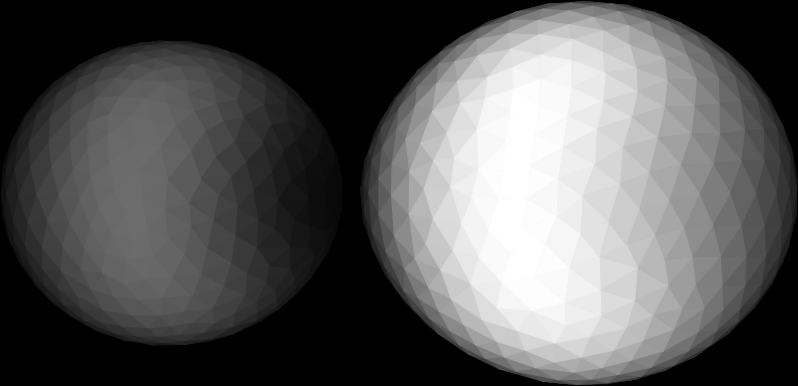
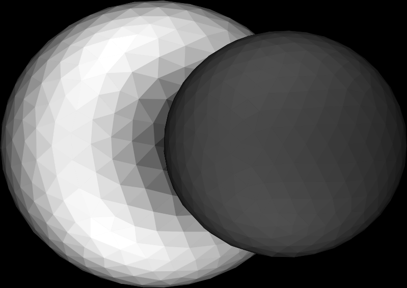
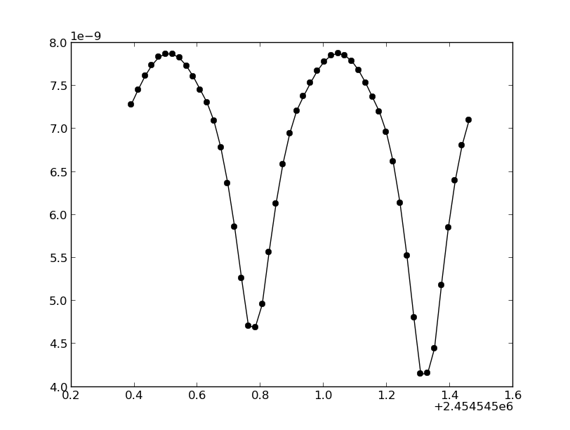

Phoebe in a nutshell
=====================

Phoebe is a code that allows you to build and fit timeseries
of observations of stars and multiple systems via a flexible and intuitive
object-oriented Python interface.

In short, you can create objects, specify their observational properties and
dynamics, and compute photometry, spectroscopy, interferometry, etc.

Phoebe's universe consists of solid :index:`Bodies <single: Body>`. Every ``Body``
has two main properties:

    1. It has a ``mesh``
    2. It has ``parameters``

A :index:`mesh` is a collection of triangles that can have physical properties (e.g.
temperature) and properties that can be directly observed (e.g. intensity).
The parameters are a collection of ParameterSets which all have their specific
contexts. There are four main types of :index:`ParameterSets`:
    
    1. **passband dependent  (pbdep)** are ParameterSets holding sufficient
       information to simulate data. They contain information on how to
       generate quantities that can be directly observed. 
       
    2. **synthetic (syn)** are simulated data.
    
    3. **observations (obs)** are the actual observations.
    
    4. ParameterSets containing information on the position, shape and
       physical properties of the mesh at any given time. They don't contain
       a generic pre- or suffix. The most frequently used ones are **star**,
       **component** and **orbit**.
    
The first three types of ``ParameterSets`` are tightly linked to the computation
of observables. We call each different observable a ``category``, and currently
the possible categories are:
    
    1. **lc**: photometry
    2. **rv**: radial velocities
    3. **sp**: spectroscopy
    4. **if**: interferometry
    5. **pl**: spectropolarimetry
    6. **ps**: point-source representation
    
For each ``category``, there are three different contexts, to distinguish between
the passband dependent parameters (e.g. ``lcdep`` ), the synthetic calculations
(e.g. ``lcsyn`` ) or the observations (e.g. ``lcobs`` ).

Different Bodies may be joined in a :index:`BodyBag`, and a BodyBag is a Body.

A Body thus contains sufficient information to compute its mesh and compute
the physical properties and observable quantities of its triangles.

Units
=====

Space-time in the universe is measured in **solar radii**
(``Rsol=6.95508e8 m``) and **Julian days** for numerical reasons.
**Flux** is in ``erg/s/cm2/AA``, **magnetic field strength** in ``Gauss``.

Introductory examples
=====================

Minimal example: my first binary image in 5 lines of code
---------------------------------------------------------

Open a ``Python`` (or preferably ``ipython`` with the ``--pylab`` option) shell::

    $:> ipython --pylab
    
In this minimal example, we need to import the ``create`` module from the
``phoebe`` package which makes a library of function available that allow to
easily initiate default parameters and Bodies. We'll use the
``matplotlib`` package to make images and show them to the screen:

::

    from phoebe import create
    from matplotlib import pyplot as plt
    

We create two stars, an A0 main sequence star and a B9 main sequence star.

::

    Astar = create.star_from_spectral_type('A0V')
    Bstar = create.star_from_spectral_type('B9V')
    

Next, we put these stars in a close binary system with a circular orbit with
a system semi-major axis of 0.045 AU.

::

    system = create.binary_from_stars(Astar,Bstar,sma=(0.045,'au'),create_body=True)

Finally, we make (and show) an image of the system at a certain time:

::

    system.set_time(2454545.39)
    system.plot2D()
    plt.show()
    

That's it! OK, this is really 8 lines of code, but in principle, the matplotlib
part is not necessary in the IPython shell, and the phoebe import statement
can be hidden in a startup script.

Other passband dependents: light curves, spectra and all that stuff
-------------------------------------------------------------------------

It is possible to compute more observables than just an image. If you want
to know the total received flux of the system, you can call the ``lc``
attribute of a system. To compute a spectrum, call ``spectrum``, for
interferometric visibilities, call ``ifm``, and for radial velocities call
``rv``:

::

    system.lc()
    system.rv()
    system.sp()
    
    mylc = system.get_synthetic('lc',cumulative=True)
    myrv = system.get_synthetic('rv',cumulative=True)
    myspec = system.get_synthetic('sp',cumulative=False)
    

The object that is returned here is a 
:py:class:`DataSet <phoebe.parameters.datasets.DataSet>`,
a particular kind of
:py:class:`ParameterSet <phoebe.parameters.parameters.ParameterSet>`, where
the actual time points and computed fluxes are parameters inside the set. You
can access these arrays dictionary-style (as you can do with all Parameters of a
ParameterSet):

::

    times,signal = mylc['time'],mylc['flux']
    

If there are multiple ``lcdep`` defined, you need to specify the reference (``ref``)
argument when calling :py:func:`get synthetic <phoebe.backend.universe.PhysicalBody.get_synthetic>` (see more advanced examples). Since we
only used one of each *pbdep* type, there is no ambiguity so we don't need
to specify it here. If ``cumulative=True``, the appropriate synthetic
computations will be summed over all subsystems (here the components).
Otherwise, a list of ``ParameterSets`` will be returned (or a nested list if
the system is a BodyBag containing other BodyBags).

Granted, computing a light curve at one single point is a bit boring, so
let's compute the light curve and spectra for a fifth of an orbit. The
orbital period for this is system is computed implicitly in :py:func:`create.star_from_binary_stars <phoebe.parameters.create.binary_from_stars>`
and derived from the stellar masses and orbital separation via
:py:func:`Kepler's third law <phoebe.dynamics.keplerorbit.third_law>`. We'll define it here explicitly, but show later how to retrieve it
from the system. For each time step we consider, we compute the light curve
and the spectrum.

::

    P = 1.09147510362
    for time in range(1,11):
        system.set_time(2454545.39 + time/50.*P)
        system.lc()
        system.sp()
        

We can now retrieve all the computed *pbdeps* in one go:

::

    mylc = system.get_synthetic('lc',cumulative=True)
    myspec = system.get_synthetic('sp',cumulative=False)

And make a plot using ``matplotlib``. Notice that the spectra contain two
sets of unnormalised spectra, one for each component. The continuum flux is
also provided, so it is straightforward to plot the normalised spectra:

::

    plt.figure()
    plt.subplot(121)
    plt.plot(mylc['time'],mylc['flux'],'ko-')
    plt.subplot(122)
    for i in range(len(mylc['time'])):
        plt.plot(myspec[0]['wavelength'][i],myspec[0]['flux'][i]/myspec[0]['continuum'][i]+i/30.,'k-')
        plt.plot(myspec[1]['wavelength'][i],myspec[1]['flux'][i]/myspec[1]['continuum'][i]+i/30.,'r-')
    plt.show()
    

.. image:: images_tut/my_first_observables.png
   :scale: 75 %
   :align: center

Expanding the minimal example
-----------------------------

So what happened here? Where do you put all the parameters? Let's remove some
of the shortcuts in the minimal example, create the same binary system
but with the B star's radius equal 3.6 solar radii, and explain stuff on the
way.

First, we'll need to unleash the full power of Phoebe to access the most
common functions and modules::
    
    import phoebe
    
Done. Now let's create that B-star from its spectral type

::

    Bstar = create.star_from_spectral_type('B9V')
    

This line of code creates a :py:class:`ParameterSet <phoebe.parameters.parameters.ParameterSet>` of type :ref:`Star <parlabel-phoebe-star>`.
Though a ParameterSet is a built-in object of the Phoebe package, for now, you can
regard it as a normal dictionary with a fancy string representation. This
dictionary-type structure contains all the parameters relevant for a star:

::

    print(Bstar)
    

Returns::

          teff 10715.193052      K x phoebe Effective temperature
        radius 3.579247       Rsol x phoebe Radius
          mass 6.002267       Msol x phoebe Stellar mass
           atm kurucz           --   phoebe Bolometric Atmosphere model
     rotperiod 0.90517           d x phoebe Polar rotation period
       diffrot 0.0               d x phoebe (Equatorial - Polar) rotation period (<0 is solar-like)
         gravb 1.0              -- x phoebe Bolometric gravity brightening
          incl 90.0            deg x phoebe Inclination angle
      distance 10.0             pc x phoebe Distance to the star
         shape equipot          --   phoebe Type of surface
           alb 1.0              -- x phoebe Bolometric albedo (alb*flux used
                                            for heating, 1-alb for reflection)
        redist 0.0              -- x phoebe Global redistribution parameter:
                                            (1-redistr)*flux is used for local
                                            heating, redistr for global heating
    irradiator False            --   phoebe Treat body as irradiator of other objects
          abun 0.0              --   phoebe Metallicity
         label B9V_54dd4435-0   --   phoebe Name of the body
       ld_func claret           --   phoebe Bolometric limb darkening model
     ld_coeffs kurucz           --   phoebe Bolometric limb darkening coefficients
     surf_grav 128.540315707   n/a   constr constants.GG*{mass}/{radius}**2

In the left column,
you see parameter names (*qualifiers*). The next column shows the value. The
third column gives the unit of the value if applicable. If the unit equals ``n/a``,
then it is not available, and the parameter should actually be a constraint.
Phoebe cannot derive the unit of constraint, simply because computations with
units are not used there. However, before executing the constraints, Phoebe
converts all parameters to SI. This means that constrained values are always
given in SI units. For example, the ``surf_grav`` here is given in ``m/s2``.

The fourth column marks
``o`` if the parameter is *adjustable*, ``x`` if the parameter is considered
fixed (see fitting examples), and ``--`` if it is not possible to fit it (e.g.
base it is a filename or so). The fifth
column contains the *frame* name of
the parameter. This is to distinguish the framwork, e.g. a parameter in
the Wilson-Devinney framework with the same name can have a different meaning,
or different units or different defaults. The last column contains a short
human-readable description of the parameter. You can also see that the last
parameter is not of the the 'phoebe' framework, but actually a constraint. As
mentioned above, a constraint is a parameter which is derived from other values. For example, the
surface gravity can be computed given the mass and radius. The exact formula
is given in the description column, and the units are always SI. Each
*context* in Phoebe has a ParameterSet predefined. With *context*, we mean a
collection of parameters that belong together. This could be for example a
star, a binary companion, a binary orbit, a disk, but also a light curve,
radial velocity curve or details on the mesh.

Back to the example: to change the radius to be 3.6 you can do one of

::

    Bstar['radius'] = 3.6
    Bstar['radius'] = 3.6,'Rsol'
    Bstar['radius'] = 2503828.8,'km'
    

Next we want to create a binary. You can already guess that for a binary, we
need a parameterSet describing the orbit and two to describe the parameters
of the components. The :py:func:`create.star_from_binary_stars <phoebe.parameters.create.binary_from_stars>` uses the input from the
stellar parameters to convert them to binary parameters, given the extra
information on eccentricity and separation. The mass ratio can be readily
derived from the stars, and the radii can be translated to potential values.
If you want to do this stuff manually, you can create empty (default)
ParameterSets, and fill in all the values yourself.

::

    comp1,comp2,orbit = create.binary_from_stars(Bstar,Astar,sma=(0.045,'au'))
    

Notice that the calling signature is a little different from the minimal example.
The reason is that we don't take the shortcut of creating a :py:class:`Body <phoebe.backend.universe.Body>`
right away. Bodies are defined in the :py:mod:`universe <phoebe.backend.universe>`,
and they represent... well, bodies in the universe. A Body can be a star, a
disk, a Ferrari, a UFO... basically anything that is solid. A Body naturally
contains parameterSets with its properties (i.e. everything it needs to 
know on how it looks and where it is located at any given time), but it also
contains methods to compute the mesh, specific intensities, velocities etc.

The Body we need to create in the case of a binary system, is the
:py:class:`BinaryRocheStar <phoebe.backend.universe.BinaryRocheStar>`. It needs a
ParameterSet describing the star itself (temperature, potential values etc...),
it also needs the orbital parameters so that it knows where it is located at
any given time, it needs parameters describing the mesh (i.e. how dense it
needs to be sampled and with what method it needs to sample), but it also
needs details on the parameters that are passband dependent. The latter are
called *pbdeps*.

To summarize: we already have the component and orbital information, thus
all is left is to define the mesh and light curve parameters.

::

    mesh = phoebe.ParameterSet(context='mesh:marching')
    lcdep = phoebe.ParameterSet(context='lcdep')
        

We leave everything to its default parameters and get to those later. Now
we can finally create the body for the Bstar:

::

    Bstar = phoebe.BinaryRocheStar(comp1,orbit=orbit,mesh=mesh,pbdep=[lcdep])
    

The calling signature is different for each type of predefined Body, but it
usually first needs parameters related to the Body itself, then parameters
related to the time evolution of the Body, and finally parameters that are
relevant for the computation of the mesh. The *pbdeps* all go together
in a list to ``pbdep``. The Body will sort them out itself, so the order and
type of *pbdep* can safely be mixed. We can do something similar for the
A-star, and reuse the ``lcdep`` parameterSet. We will use the same orbit and 
mesh set.

::

    Astar = phoebe.BinaryRocheStar(comp2,orbit,mesh,pbdep=[lcdep])
    

Now we need to put these two star in a binary system. Technically, this is
not necessary: each of two components have enough information to know when
to be where. You could set the times of the two components separately (but
to the same time point) and then go on to compute the ``lc`` for each of the
two components. The :py:class:`BodyBag <phoebe.backend.universe.BodyBag>` facilitates these actions: it combines several
Bodies into one system. The sub-Bodies do not necessarily need to be of the
same type, but the **number and type** of *pbdeps* need to be exactly the same.
The **parameters** in the *pbdep* parameterSets can be different, as long as
there is a one-to-one correspondence between the number and types of each
*pbdep*. In this example, there is only one *pdep* set, so the one-to-one
correspondence is trivial. The mapping is done via the ``ref`` attribute of
each *pbdep* set: those with the same reference will be matched together. We
made sure this is the case by taking the same ``lcdep`` for both stars.

::

    system = phoebe.BodyBag([Bstar,Astar])
    

Detecting eclipsed parts and subdivision
----------------------------------------

Huge confession to make: I cheated in the creation of the minimal example.
I made sure none of the star eclipsed the other one, so we didn't need to 
bother about eclipsed parts. Let's have a closer look at what happens
when one star eclipses the other one:

::

    system.set_time(2454545.29)
    system.plot2D()
    plt.show()
    
    

Remember we have access to the two stars separately, so we can make 2D plots
of both of them:

::

    Bstar.plot2D()
    Astar.plot2D()
    plt.show()
    

+-----------------------------------------+---------------------------------------+
| Primary                                 | Secondary                             |
+-----------------------------------------+---------------------------------------+
| .. image:: images_tut/minex_02.png      | .. image:: images_tut/minex_03.png    |
|    :width: 233px                        |    :width: 233px                      |
+-----------------------------------------+---------------------------------------+

One of the stars is eclipsed, but the `program` does not see that there are
eclipsed parts. One star doesn't know about the other one yet. What it does know
by itself, is what the front and back is. During each :py:func:`set_time <phoebe.backend.universe.BinaryRocheStar.set_time>` call,
:py:class:`BinaryRocheStar <phoebe.backend.universe.BinaryRocheStar>` silently decides that whatever is facing to the observer
is visible (the front) and whatever is facing backwards is invisible (the
back), because a :py:class:`BinaryRocheStar <phoebe.backend.universe.BinaryRocheStar>` is a convex shape. In order to see that,
we need to tilt the binary a bit, so that we can see part of the back sides:

::

    angle = -3.1415/180.*30.
    system.rotate_and_translate(theta=angle,incl=angle,incremental=True)
    Bstar.plot2D()
    Astar.plot2D()
    system.plot2D()
    plt.show()
    

+-----------------------------------------+---------------------------------------+---------------------------------------+
| Primary                                 | Secondary                             | Whole system                          |
+-----------------------------------------+---------------------------------------+---------------------------------------+
| .. image:: images_tut/minex_02b.png     | .. image:: images_tut/minex_03b.png   | .. image:: images_tut/minex_02c.png   |
|    :width: 233px                        |    :width: 233px                      |    :width: 233px                      |
+-----------------------------------------+---------------------------------------+---------------------------------------+

To continue our example, we need to reset the body and set the time again
(the reset is necessary because when there are two consecutive calls with
the same time, the second one is simple ignored).

::

    system.reset()
    system.set_time(2454545.29)
    
    

We need to explicitly ask the program to check for these
eclipsed parts:

::

    system.detect_eclipse_horizon(eclipse_detection='hierarchical')
    
    Bstar.plot2D()
    Astar.plot2D()
    plt.show()
    

+-----------------------------------------+---------------------------------------+
| Primary                                 | Secondary                             |
+-----------------------------------------+---------------------------------------+
| .. image:: images_tut/minex_04.png      | .. image:: images_tut/minex_05.png    |
|    :width: 233px                        |    :width: 233px                      |
+-----------------------------------------+---------------------------------------+

The image of the secondary star is exactly the same because it is in front,
but now we clearly see that a part of the primary is eclipsed. The :py:func:`plot2D <phoebe.backend.universe.Body.plot2D>`
function shows a dark grey band exactly at those triangles that are partially
eclipsed: in a first approximation, it assumes that the light that comes
from these triangles is half the total intensity of the triangle.

We make the grey band thinner by *subdivision*: we subdivide each partially
eclipsed triangle into 4 smaller triangles and repeat the detection algorithm.
Note that you need to call :py:func:`detect_eclipse_horizon <phoebe.backend.universe.Body.detect_eclipse_horizon>` first, so that the
method :py:func:`subdivide <phoebe.backend.universe.PhysicalBody.subdivide>` knows what triangles need to be subdivided:

::

    for i in range(3):
        system.subdivide()
        system.detect_eclipse_horizon(eclipse_detection='hierarchical')
        Bstar.plot2D()
    plt.show()
    

+-----------------------------------------+---------------------------------------+---------------------------------------+
| First subdivision                       | Second subdivision                    | Third subdivision                     |
+-----------------------------------------+---------------------------------------+---------------------------------------+
| .. image:: images_tut/minex_06.png      | .. image:: images_tut/minex_07.png    | .. image:: images_tut/minex_08.png    |
|    :width: 233px                        |    :width: 233px                      |    :width: 233px                      |
+-----------------------------------------+---------------------------------------+---------------------------------------+

A complete light curve
----------------------

Now we are ready to compute a whole light curve of this binary system,
introducing also the :py:func:`reset <phoebe.backend.universe.Body.reset>` method of the Bodies. The function :py:func:`reset <phoebe.backend.universe.Body.reset>`
basically sets the time to ``None``, so that the mesh is recomputed when
:py:func:`set_time <phoebe.backend.universe.BinaryRocheStar.set_time>` is called. The bodies are smart enough not to recalculate the
mesh if you call :py:func:`set_time <phoebe.backend.universe.BinaryRocheStar.set_time>` twice with the same value for the time. Also,
some meshes are independent of time, in which case consecutive calls to
:py:func:`set_time <phoebe.backend.universe.BinaryRocheStar.set_time>` will not do anything.

Also note that after a :py:func:`subdivide <phoebe.backend.universe.PhysicalBody.subdivide>`
call, there is a call to :py:func:`unsubdivide <phoebe.backend.universe.PhysicalBody.unsubdivide>`.
This is not strictly necessary, but if you don't you will keep the extra
mesh points from the previous steps, continously increasing the number of mesh
points. In most cases, this is undesirable, since it slows things down
exponentially.

The inner loop of the following piece of code does three subdivisions. After
each subdivision, we redetect the eclipsed parts to minimize the number of
triangles to be subdivided.

::

    system.reset()  # reset the time
    
    period = system[0].params['orbit']['period']
    for time in range(50):
        system.set_time(2454545.39+time/50.*period)
        system.detect_eclipse_horizon(eclipse_detection='hierarchical')
        for i in range(3):
            system.subdivide()
            system.detect_eclipse_horizon(eclipse_detection='hierarchical')
        system.lc()
        system.unsubdivide()
    

All information is easily recovered by callling a cumulative :py:func:`get synthetic <phoebe.backend.universe.PhysicalBody.get_synthetic>`
again.

::

    mylc = system.get_synthetic('lc',cumulative=True)
    
    plt.plot(mylc['time'],mylc['flux'],'ko-')
    plt.show()
    

For more information on the Parameters (how to create them, how to save and
load them to and from an ASCII file etc., see the :py:mod:`Parameters module in the API docs <phoebe.parameters.parameters>`.

For more information on the Bodies (what methods exist etc., see the
:py:mod:`universe module in the API docs <phoebe.backend.universe>`.

For more worked out examples, see the rest of this tutorial.
